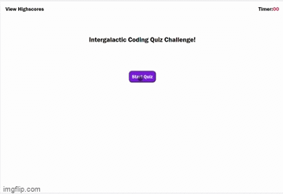

# 04 Web APIs: Code Quiz

## Description

This assignment required me to create a quiz that adjusts dynamically using javascript. After the user clicks the start button, they are presented with questions. If answered correctly the next question is rendered; however, if the wrong question is selected, then the timer is reduced by 5 seconds. If the player successfully answers all the questions they win the game and they are able to record their score. If the timer runs out the player loses.

## Tasks 

- Created an interactive quiz that renders quiz prompts and answer buttons dynamically after the start button is clicked.
- Implemented a game timer that handles time and win conditions.
- Implemented a penalty function that subtracts from the user time and score if questions are answered incorrectly.
- IF the timer reaches 0 the user loses the game.
- If the player wins, they are able to record their score in the local storage.
- If the user clicks view scores they can see their past scores.

## Usage

## Links
Deployed Webpage: https://rambriz91.github.io/intergalactic/
GitHub Repo Page: https://github.com/rambriz91/intergalactic

## Credits

- https://www.codeinwp.com/snippets/add-event-listener-to-multiple-elements-with-javascript/
-   https://www.w3schools.com/jsref/met_win_cleartimeout.asp#:~:text=The%20clearTimeout()%20method%20clears,with%20the%20setTimeout()%20method.
-   https://www.javascripttutorial.net/dom/manipulating/remove-all-child-nodes/
-   https://www.youtube.com/watch?v=qORYO0atB6g

## License

MIT License

Copyright (c) [2023] [Robert Ambriz]

Permission is hereby granted, free of charge, to any person obtaining a copy
of this software and associated documentation files (the "Software"), to deal
in the Software without restriction, including without limitation the rights
to use, copy, modify, merge, publish, distribute, sublicense, and/or sell
copies of the Software, and to permit persons to whom the Software is
furnished to do so, subject to the following conditions:

The above copyright notice and this permission notice shall be included in all
copies or substantial portions of the Software.

THE SOFTWARE IS PROVIDED "AS IS", WITHOUT WARRANTY OF ANY KIND, EXPRESS OR
IMPLIED, INCLUDING BUT NOT LIMITED TO THE WARRANTIES OF MERCHANTABILITY,
FITNESS FOR A PARTICULAR PURPOSE AND NONINFRINGEMENT. IN NO EVENT SHALL THE
AUTHORS OR COPYRIGHT HOLDERS BE LIABLE FOR ANY CLAIM, DAMAGES OR OTHER
LIABILITY, WHETHER IN AN ACTION OF CONTRACT, TORT OR OTHERWISE, ARISING FROM,
OUT OF OR IN CONNECTION WITH THE SOFTWARE OR THE USE OR OTHER DEALINGS IN THE
SOFTWARE.